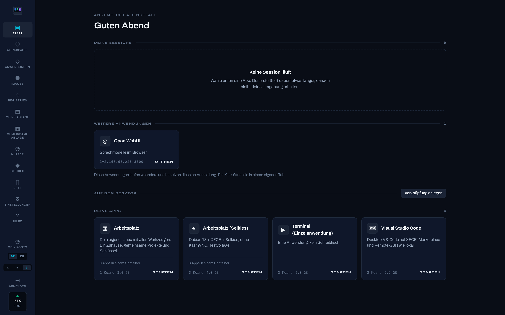
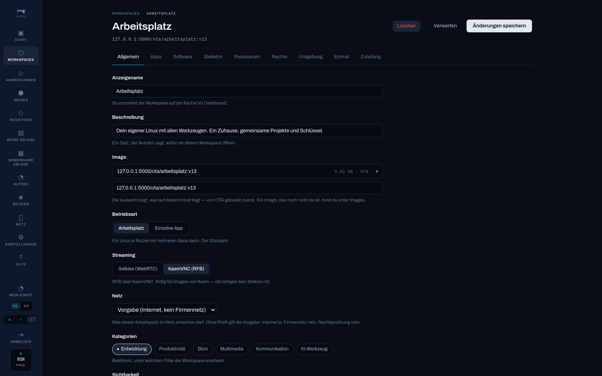
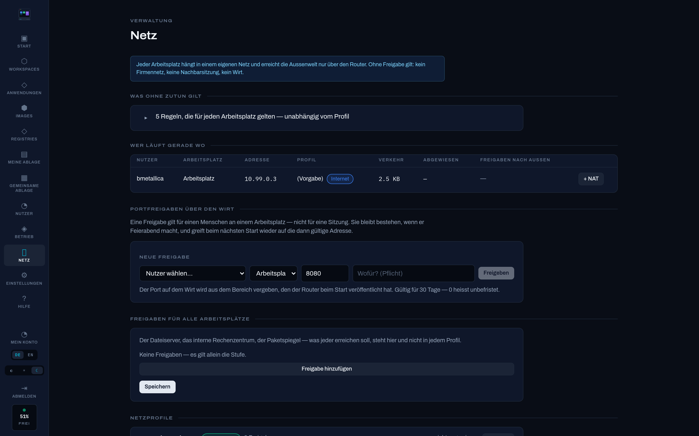
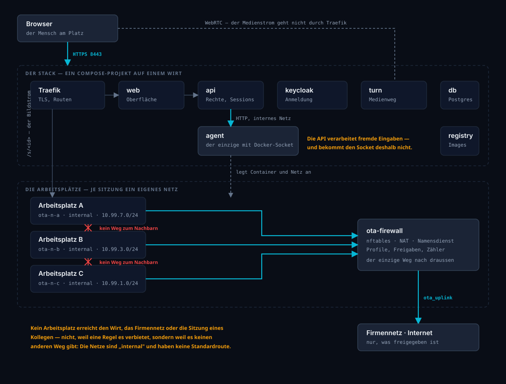

<!-- Languages: Deutsch · English (here) -->
[Deutsch](README.md) · **English**

<p align="center">
  
</p>

# OpenTerminalApps

A self-hosted platform that gives every user **their own Linux workspace in the browser**. Their
tools are installed inside it — VS Code, VSCodium, JetBrains, Firefox, a terminal — and each one
streams on its own, filling the window. They all share **one home**: the same projects, the same SSH
key, the same clipboard.

Alongside that, single applications can run as throwaway containers, and existing Kasm images and
whole registries can be attached — as an addition, not as the foundation.

**Every workspace sits in a network of its own** behind a router: no corporate network, no
neighbouring session, no host — until someone explicitly opens it ([firewall.md](firewall.md)).

> **Status:** running and in use. 446 automated checks, 107 of them in a real browser. What is still
> missing is listed openly in [roadmap.md](roadmap.md) — nothing there is dressed up.
>
> The documentation is written in German. This file is the exception.



*The start screen: your own running session with its applications, what it was given in cores and
memory — and what it is allowed to reach on the network.*

---

## Quick start

**Prerequisites** on a Linux host: `docker` with the compose plugin (`docker compose version` must
answer), plus `git`, `make` and `openssl`. Ports **8443** and **8081** must be free — 443 is left
alone on purpose so an existing Kasm can keep running alongside. Both are changeable via
`OTA_HTTPS_PORT` and `OTA_HTTP_PORT` in `deploy/.env`.

Once streaming is in use, add **3478** (TURN) and **49160–49260/UDP** for the media path, plus
**30000–30019** as the pool for published ports. And an address range for the workspace networks,
`10.99.0.0/16` out of the box — it must **not** overlap with the corporate network. All of it is
configurable and explained in [`deploy/.env.example`](deploy/.env.example).

```bash
git clone https://github.com/bmetallica/openterminalapps.git
cd openterminalapps

sudo make setup                  # .env with secrets, certificate, directories
sudo make up                     # build and start (a few minutes the first time)
sudo make admin NAME=yourname    # first administrator account
```

`make setup` **generates the secrets and writes them in itself** — nothing to fill in by hand
afterwards. Running it again leaves existing values untouched.

`sudo` is needed because OTA creates directories under `/srv/ota` and talks to the Docker socket.
If you are in the `docker` group and created `/srv/ota` yourself, you can drop it.

`make admin` creates the account and **prints a generated password**. It is good exactly once: OTA
asks for a new one at first sign-in. Then:

```
https://<host>:8443/
```

**Import the root certificate once** and the browser stops warning — also after any later
certificate change:

```bash
sudo cp deploy/certs/ota-ca.crt /usr/local/share/ca-certificates/ota-ca.crt   # Linux, system-wide
sudo update-ca-certificates
```

In the browser: Settings → Certificates → Authorities → import `deploy/certs/ota-ca.crt` and tick
"trust this CA to identify websites".

**Is it running?**

```bash
make ps                          # every service should be "healthy"
curl -k https://localhost:8443/healthz
```

If something is stuck: `make logs` and [handbook chapter 12](docs/wiki/12-fehlersuche.md) — real
failures from operation with symptom, cause and repair.

### Your first workspace

After signing in: **Workspaces → Create**, enter an image (for example
`kasmweb/core-ubuntu-jammy:1.16.0`), assign it to the `users` group, enable it. Then start it under
**Start** and publish its applications via **Software → Look inside the image**.
In detail in [handbook chapter 2](docs/wiki/02-erste-schritte.md) (German).

## What it does

**The workspace**
- One container per user, each application on its own screen, started only when asked for
- Every application in its own browser tab with its own address — and installable as a desktop
  shortcut (PWA)
- The remote screen **grows with the window**: no black border, no scaling
- Clipboard in both directions, including between two applications in the same container
- A classic XFCE desktop as an additional view

**Administration**
- Resources **per user and workspace**: user A gets 2 cores, user B gets one
- **A quota per home directory** and a floor for free disk space — a comprehensible refusal instead
  of a container that stalls mid-work on a write
- **Visibility per application and group**, for when a licence does not cover everyone
- **Two-factor enforceable per group**, with a **passkey** (fingerprint, face, security key) or a
  one-time code — offered, not required; `/healthz` and `/metrics` for monitoring
- Users, groups and permissions; administrators are `root` inside their own container
- **Sign-in against LDAP or Active Directory**, with group mapping and a check button. Local
  accounts stay untouched — an entry of the same name cannot take one over
- Sign-in limit configurable (30 min to 48 h), rolling — nobody working is ever signed out
- Interface in German and English, **dark or light** (or matching the system) — both switchable
  before signing in as well
- The handbook lives **inside the application**, filtered by permission
- **My account** for everyone: change your own password, set up two-factor with recovery codes

**The network of the workspaces**
- **One network per workspace**, all of them terminating in a router. No corporate network, no
  neighbouring session, no host — and not because a rule forbids it, but because there is no other
  way out: the networks are `internal`, so Docker sets up neither NAT nor a default route
- **The base rule set is visible in the interface** — what OTA opens for itself (TURN, its own
  address, name service, proxy, time server), each line with target, ports, **reason and origin**.
  Derived from `.env`, hence readable and not editable
- **Profiles per template** in three levels: *isolated* (only what OTA needs), *internet* (the
  default) and *off* — the last one lifts every restriction, requires a justification and is logged
- **Exceptions by address, range or name**, globally or per profile. Names work because the router
  is also the name service: whatever it answers, it writes into the rule itself — exception and
  connection come from the same lookup
- **"+ NAT"**: publish a port of one workspace through the host, time-limited, for someone who wants
  to show their own application. The expiry is enforced, not just displayed
- **Stable addresses** per person and template — across the evening and across a restart. Without
  that, an upstream corporate firewall could not be pointed at a workspace
- **An overview with throughput and dropped packets** per workspace. A port scan looks exactly like
  what it is in that number



*Where a packet ends, and why — the default level. **The third row is the important one**: nothing
is *dropped* on the way to the neighbour, because there is no line there at all. A rule can be
wrong; a missing path cannot. Four more diagrams (isolated, off, an exception by name, and an
inbound published port) are in [handbook chapter 23](docs/wiki/23-netz.md).*

> The local sign-in at `/api/auth/login` is the emergency door, not the main one — Keycloak
> accounts are turned away there. It is rate-limited to ten attempts per minute and sender, and the
> lockout after failed attempts applies per **(account, sender)**: it cannot be aimed at a
> colleague.

**Getting software into the workspaces**
- Pick packages, build the image, activate the version — with a log and a way back
- **Packages are checked first**: does the image know the name, and is it any good?
  (On Ubuntu, `firefox` is only a pointer to a snap and useless in a container)
- **Recipes** for anything that is not a plain package — with a guided builder for your own
- **Find applications inside the image**: OTA reads the `.desktop` files and suggests name, symbol
  and start command. Nobody has to know where a binary lives
- **The real icon from the package** — the fox, not a circle. OTA looks where the Freedesktop
  specification puts it, scales it down to 128 pixels (VSCodium ships 428 KB) and serves it
  cacheably
- **Three kinds of storage**: shared storage for files that belong in every workspace (read-only
  inside the container), a **personal one per user** under `/mnt/austausch` — writable, the way in
  and back out —, and **a drive per group** under `/mnt/gruppen/<name>`: the same files for a team.
  Membership decides who gets into a group drive and nothing else — an administrator only reaches
  the groups they are in themselves
- **A skeleton profile** per workspace: what a home directory starts out as. Individual paths can be
  enforced at every start — the exception, not the rule. Plus **a subtree per application** that
  only arrives the first time that application starts: whoever only uses the terminal does not need
  the IDE's settings in their home
- **Freeze a session**: set it up in your own workspace, review the preview, adopt it as a new
  version. The home stays out, secrets are flagged, the sudo exception is removed
- **A script at session start**, per workspace, for anything that belongs in the home directory but
  not in the image

**Operations**
- **An own base image** `ota/base-desktop`: Debian 13 + XFCE + **Selkies**, with no application and
  **no third-party streaming software** — H.264 over WebRTC instead of rectangles over RFB. The
  account is called `ota` and lives in `/home/ota`; nothing in it carries the Kasm name.
  `scripts/build-desktop-image.sh --pruefen` measures 19 points against the agent's contract
- **The older path remains** — `ota/base-xfce` (Ubuntu + KasmVNC) for images from Kasm that do not
  ship Selkies. Switchable per workspace under **Streaming**
- **A bill of materials per image** (`make sbom`) in SPDX and CycloneDX — needed as soon as an image
  leaves the building
- Own registry in the stack; if an image is missing locally it is fetched from there at start
- Backup and restore of profile, container and database, by hand and on a schedule
- HTTPS out of the box with a small own CA, replaceable or behind a reverse proxy
- **Nothing is fetched from foreign hosts.** Fonts ship with the interface; it requests nothing from
  the internet — it looks the same offline and behind a corporate proxy, and no user's IP address
  leaves the building
- **Nothing grows without a limit.** Container logs are capped at 10 MB × 3 — for the services **and**
  for every workspace. In the database log, behavioural entries (sign-ins, sessions, app starts)
  expire after 90 days and administrative ones after 365; the sweep runs daily and is itself logged
- **Runs next to an existing Kasm installation** on the same host, without changing anything there

> **Keycloak's admin console is reachable** at `/auth/admin/`, and that is deliberate: OTA manages
> Keycloak from the inside, but when something breaks that OTA's interface does not cover, the
> console is the only way in — walling it off means locking yourself out. That trade holds for an
> intranet; the moment OTA is reachable from the internet, put an `ipAllowList` in front of it.
> Details in [handbook chapter 18](docs/wiki/18-zentrale-anmeldung.md).

## A look at administration

| | |
|---|---|
|  |  |
| **The template.** One screen per workspace — image, mode, streaming path, and what it may reach on the network. | **The network.** What applies without being asked, with reason and origin per line; who is working where, throughput and dropped packets. |

Images are produced by `make bilder` ([`tests/screenshots.mjs`](tests/screenshots.mjs)), which signs
in, walks the screens and cleans up after itself. Two things it deliberately does not do: attach to
someone else's session (it starts its own), and capture screens listing people.

## How it is built

```
Browser ──HTTPS──▶ Traefik ──┬──▶ web       interface (nginx)
                             ├──▶ api       REST, sign-in, permissions, sessions
                             └──▶ /s/<id>   a session's stream (forwardAuth)
                                     │
                    api ──HTTP──▶ agent ──▶ Docker socket
                                     │
                            session container (KasmVNC)
```



**Only `agent` touches Docker.** The API processes user input and therefore does not get the socket —
the same separation applies to the host filesystem.

| Directory | Contents |
|---|---|
| `web/` | Interface (React, TypeScript, hand-written CSS, no UI library) |
| `api/` | REST API, sign-in, permissions, sessions (FastAPI, PostgreSQL) |
| `agent/` | The **only** service with Docker access; containers, displays, images, shared storage |
| `deploy/` | Compose stack, Traefik, registry, certificates |
| `extension/` | Firefox add-on for the clipboard |
| `docs/wiki/` | Handbook — served inside the application as help |
| `images/` | The own base image `ota/base-xfce` (Ubuntu + XFCE + KasmVNC) |
| `tests/`, `scripts/` | Checks, certificate, migration from Kasm, bill of materials |

## Documentation

- **[Handbook](docs/wiki/README.md)** — use, administration, operations, troubleshooting (23
  chapters, German)
- **[plan.md](plan.md)** — architecture **and the reasoning behind it**, dead ends included
- **[docs/adr/](docs/adr/README.md)** — decisions that are expensive to reverse, with the
  alternatives that would not have held (German)
- **[roadmap.md](roadmap.md)** — what is done and what is not

One pointer: [chapter 12](docs/wiki/12-fehlersuche.md) documents real failures from operation with
symptom, cause and repair — several of which looked for days like something other than what they
were.

## Checks

```bash
make test
```

**446 checks in seven suites**, each one setting up its own preconditions:

| Suite | Checks |
|---|---|
| `test-authz.sh` | An ordinary user provably cannot do anything administrative and cannot sit at anyone else's screen; plus container hardening, metrics, quotas and two-factor |
| `test-clipboard-bridge.sh` | Copying between two applications in one workspace: both directions, umlauts, an image, a megabyte, after a pause, and switched off |
| `tests/e2e.mjs` | The interface in a real browser — down to whether the stream actually connects |
| `test-ldap.sh` | Directory sign-in **through Keycloak** against a real OpenLDAP in a container — above all that a directory entry cannot take over a local account and an outage does not take the emergency login down |
| `test-streaming.sh` | The media path: does the TURN server actually relay, and does a picture arrive in the browser? The probe browser runs in a network from which the session container is **not** directly reachable — like a workstation on a corporate network |
| `test-firewall.sh` | The network isolation, **measured from inside**: neighbour, host, corporate network, TURN, name service, internet per level, an exception by name, a published port — and all of it again after the router restarts |
| `test-backup.sh` | Backup and restore of profile, container and database. It stops sessions to do so — **only its own**, and it checks that explicitly |

The test credentials live in `deploy/.env` as `OTA_TEST_ADMIN_PW`, not in the source.

A full run takes **about half an hour**: it starts containers, freezes an image and measures in a
real browser. Each suite can be run on its own (`bash scripts/test-authz.sh`).

## Licence

**Apache-2.0** (see [LICENSE](LICENSE)). Chosen because OTA is infrastructure: no obligations on the
operator, an explicit patent grant, and the same choice as the closest related open project (Apache
Guacamole).

OTA does **not** bundle third-party software: dependencies are fetched at build time, components
pulled at runtime as container images. **They keep their own licences and are not relicensed under
Apache-2.0 by OTA** — broken down into three layers in
[THIRD-PARTY-NOTICES.md](THIRD-PARTY-NOTICES.md), briefly in [NOTICE](NOTICE).

A workspace **image** is a composite work: OTA configuration, Selkies (MPL-2.0, **modified by
OTA**), libx264 (GPL-2.0+), XFCE, hundreds of distribution packages, the installed applications. It
is **not** "Apache-2.0".

The base image **may be passed on** — with four obligations: offer sources for the GPL parts,
include the five Selkies patches (MPL-2.0 works file by file), leave the licence texts in the image,
and ship a bill of materials. Finished workspaces containing Microsoft VS Code or Google Chrome
**may not** — the same ones with VSCodium and Firefox may.

**Applications inside a golden image keep their own licence.** For Microsoft VS Code, use within
your own corporate network is explicitly permitted; passing it on to third parties is not. Checked
against the licence text, with quotations, in
[handbook chapter 13](docs/wiki/13-lizenzen.md) — not legal advice, but read rather than
remembered.

“Kasm” is a trademark of Kasm Technologies. OTA is not a Kasm product and is not affiliated with
Kasm Technologies.
