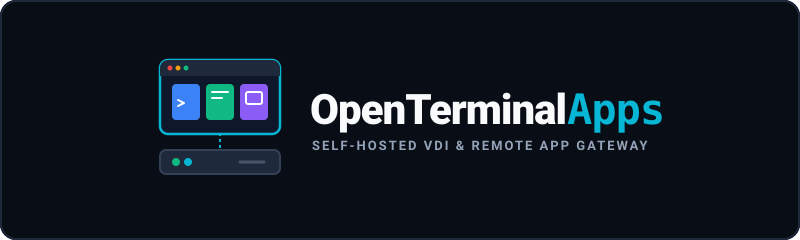

<!-- Sprachen: Deutsch (hier) · English -->
**Deutsch** · [English](README.en.md)

<p align="center">
  
</p>

# OpenTerminalApps

Selbstgehostete Plattform, die jedem Nutzer **einen eigenen Linux-Arbeitsplatz im Browser** gibt.
Darin sind seine Werkzeuge installiert — VS Code, VSCodium, JetBrains, Firefox, ein Terminal —, und
jedes lässt sich einzeln formatfüllend streamen. Alle teilen sich **ein Zuhause**: dieselben
Projekte, denselben SSH-Schlüssel, dieselbe Zwischenablage.

Daneben lassen sich einzelne Anwendungen als Wegwerf-Container starten und vorhandene Kasm-Images
sowie ganze Registries einbinden — als Zusatz, nicht als Fundament.

> **Stand:** läuft und wird benutzt. 210 automatische Prüfungen, davon 76 in einem echten Browser.
> Was noch fehlt, steht offen in [roadmap.md](roadmap.md) — nichts davon ist beschönigt.

---

## Schnellstart

```bash
make setup                 # Zertifikat und .env erzeugen
make up                    # Stack bauen und starten
make admin NAME=deinname   # ersten Administrator anlegen
```

Danach `https://<host>:8443/` öffnen.

Das Wurzelzertifikat aus `deploy/certs/ota-ca.crt` einmalig importieren, dann warnt der Browser
nicht mehr — auch nach jedem späteren Zertifikatswechsel.

## Was es kann

**Der Arbeitsplatz**
- Ein Container je Nutzer, jede Anwendung auf ihrem eigenen Bildschirm, gestartet erst bei Bedarf
- Jede Anwendung in einem eigenen Browsertab, mit eigener Adresse — und als Verknüpfung auf dem
  Desktop ablegbar (PWA)
- Der ferne Bildschirm **wächst mit dem Fenster**, kein schwarzer Rand, keine Skalierung
- Zwischenablage in beide Richtungen, auch zwischen zwei Anwendungen im selben Container
- Klassischer XFCE-Desktop als zusätzliche Ansicht

**Verwaltung**
- Ressourcen **je Nutzer und Workspace**: Nutzer A bekommt 2 Kerne, Nutzer B einen
- **Kontingent je Zuhause** und eine Untergrenze für den freien Plattenplatz — eine verständliche
  Ablehnung statt eines Containers, der mitten in der Arbeit beim Schreiben stehenbleibt
- **Sichtbarkeit je Anwendung und Gruppe**, für den Fall, dass eine Lizenz nicht für alle reicht
- **Zwei-Faktor je Gruppe erzwingbar**; `/healthz` und `/metrics` für die Überwachung
- Nutzer, Gruppen und Rechte; Administratoren sind in ihrem eigenen Container `root`
- Anmeldefrist einstellbar (30 min bis 48 h), rollend — wer arbeitet, wird nicht abgemeldet
- Oberfläche auf Deutsch und Englisch, umschaltbar auch vor der Anmeldung
- Das Handbuch liegt **im Programm**, gefiltert nach Rechten
- **Mein Konto** für jeden: Passwort selbst ändern, Zwei-Faktor mit Rückfallcodes einrichten

**Software in die Arbeitsplätze bringen**
- Pakete anklicken, Image bauen, Fassung aktivieren — mit Protokoll und Rückrollen
- **Pakete werden vorher geprüft**: kennt das Image den Namen, und taugt er überhaupt?
  (Ubuntus `firefox` ist nur ein Verweis auf ein Snap und im Container nutzlos)
- **Rezepte** für alles, was kein einfaches Paket ist — mit geführtem Bauer für eigene
- **Anwendungen im Image finden**: OTA liest die `.desktop`-Dateien und schlägt Name, Zeichen und
  Startbefehl vor. Niemand muss wissen, wo eine Binärdatei liegt
- **Gemeinsame Ablage** für Dateien, die in jeden Arbeitsplatz sollen — im Container nur lesbar
- **Skript beim Sessionstart** je Workspace, für alles, was ins Home gehört, aber nicht ins Image

**Betrieb**
- Eigene Registry im Stack; fehlt ein Image lokal, wird es beim Start von dort geholt
- Sicherung und Wiederherstellung von Profil, Container und Datenbank, manuell und nach Plan
- HTTPS ab Werk, eigene kleine CA, austauschbar oder hinter einem Reverse Proxy
- **Läuft neben einer bestehenden Kasm-Installation** auf demselben Host, ohne dort etwas
  umzustellen

## Wie es gebaut ist

```
Browser ──HTTPS──▶ Traefik ──┬──▶ web       Oberfläche (nginx)
                             ├──▶ api       REST, Anmeldung, Rechte, Sessions
                             └──▶ /s/<id>   Stream einer Session (forwardAuth)
                                     │
                    api ──HTTP──▶ agent ──▶ Docker-Socket
                                     │
                            Session-Container (KasmVNC)
```

**Nur `agent` fasst Docker an.** Die API verarbeitet Nutzereingaben und bekommt den Socket deshalb
nicht — dieselbe Trennung gilt für das Dateisystem des Hosts.

| Verzeichnis | Inhalt |
|---|---|
| `web/` | Oberfläche (React, TypeScript, handgeschriebenes CSS, keine UI-Bibliothek) |
| `api/` | REST-API, Anmeldung, Rechte, Sessions (FastAPI, PostgreSQL) |
| `agent/` | **Einziger** Dienst mit Docker-Zugriff; Container, Displays, Images, Ablage |
| `deploy/` | Compose-Stack, Traefik, Registry, Zertifikate |
| `extension/` | Firefox-Erweiterung für die Zwischenablage |
| `docs/wiki/` | Handbuch — wird im Programm als Hilfe ausgeliefert |
| `tests/`, `scripts/` | Prüfungen, Zertifikat, Migration aus Kasm |

## Dokumentation

- **[Handbuch](docs/wiki/README.md)** — Bedienung, Verwaltung, Betrieb, Fehlersuche (17 Kapitel)
- **[plan.md](plan.md)** — Architektur **und die Begründungen dahinter**, samt der Sackgassen
- **[docs/adr/](docs/adr/README.md)** — Entscheidungen, die teuer rückgängig zu machen sind, mit den
  Alternativen, die nicht getragen hätten
- **[roadmap.md](roadmap.md)** — Umsetzungsstand, ehrlich

Ein Hinweis zur Fehlersuche: [Kapitel 12](docs/wiki/12-fehlersuche.md) beschreibt echte Fehler aus
dem Betrieb mit Symptom, Ursache und Reparatur — darunter mehrere, die tagelang nach etwas anderem
aussahen, als sie waren.

## Prüfungen

```bash
make test
```

**210 Prüfungen in vier Suiten**, jede stellt ihren Vorzustand selbst her:

| Suite | Prüft |
|---|---|
| `test-authz.sh` | Ein normaler Nutzer kann beweisbar nichts Administratives tun und an keinem fremden Bildschirm sitzen; dazu Container-Härtung, Kennzahlen, Kontingente und zweiter Faktor |
| `test-clipboard-bridge.sh` | Kopieren zwischen zwei Anwendungen im selben Arbeitsplatz: beide Richtungen, Umlaute, ein Bild, ein Megabyte, nach Pause, und abgeschaltet |
| `tests/e2e.mjs` | Die Oberfläche in einem echten Browser — bis zur Frage, ob der Stream wirklich verbindet |
| `test-backup.sh` | Sicherung und Wiederherstellung von Profil, Container und Datenbank |

Die Zugangsdaten der Prüfung stehen in `deploy/.env` als `OTA_TEST_ADMIN_PW`, nicht im Quelltext.

Ein voller Lauf dauert **rund eine halbe Stunde**: Er startet Container, friert ein Image ein und
misst im Browser nach. Jede Suite lässt sich einzeln starten (`bash scripts/test-authz.sh`).

## Lizenz

**Apache-2.0** (siehe [LICENSE](LICENSE)). Gewählt, weil OTA Infrastruktur ist: keine Auflagen für
den Betreiber, ausdrückliche Patentfreigabe, und dieselbe Wahl wie beim nächstverwandten offenen
Projekt (Apache Guacamole).

OTA **enthält** keine fremde Software; die Bestandteile werden zur Laufzeit als Container-Images
bezogen und behalten ihre eigenen Bedingungen — siehe [NOTICE](NOTICE).

**Für die Anwendungen in einem Golden Image gilt deren eigene Lizenz.** Bei Microsoft VS Code ist
der Betrieb im eigenen Unternehmensnetz ausdrücklich erlaubt, die Weitergabe an Dritte nicht.
Mit Originalzitaten geprüft in [Handbuch, Kapitel 13](docs/wiki/13-lizenzen.md) — keine
Rechtsberatung, aber am Lizenztext und nicht aus dem Gedächtnis.

„Kasm" ist eine Marke von Kasm Technologies. OTA ist kein Kasm-Produkt und steht in keiner
Verbindung zu Kasm Technologies.
